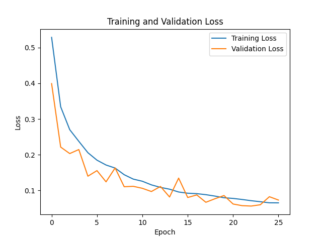
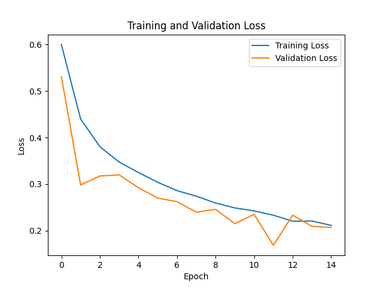
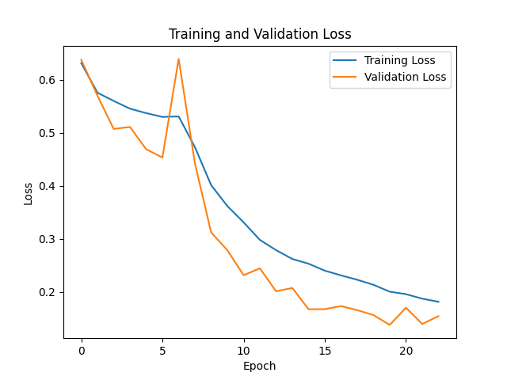

## Image-Embedding-through-CNN-Models-and-Stacking-Ensemble
Optimizing universal image embeddings for image similarity using various deep CNN models and Stacking Ensemble Technique.

This project explores the use of three deep CNN models (DenseNet121, ResNet50, VGG16) to extract image embeddings from the CIFAR-10 dataset. The models are evaluated using the mAP@5 metric to measure their performance. Fine-tuning and hyperparameter tuning are applied to further enhance the model performance. To improve embedding extraction, a Stacking Ensemble Technique is implemented, combining the strengths of the individual models. K-Means clustering visualizes the embedding clusters generated by each model, and KNN is employed to retrieve and display similar images based on the embeddings.
### Objectives
```
•	To evaluate the performance of DenseNet 121, ResNet 50, and VGG 16 models for image embedding across diverse visual domains.
•	To Assess the effectiveness of K-nearest neighbors algorithm in measuring image similarity using embeddings.
•	To Examine the performance of MAP@5 metric in evaluating the performance of image embedding models.
•	Explore the enhancement of model performance through the utilization of Stacking Ensemble Technique in image embedding task.
•	Investigate the effects of fine-tuning and hyperparameter tuning on the performance of deep CNN models and stacking ensemble technique.
```
 ### Project Structure
```
Image-Embedding-through-CNN-Models-and-Stacking-Ensemble/
│
├── CNN Models/
│   ├── data_preprocessing.py            # Loads CIFAR-10 dataset, applies normalization, splits & augmentations
│   ├── Densenet121_Model.py             # Builds, trains, and extracts embeddings using DenseNet121
│   ├── Resnet50_Model.py                # Builds, trains, and extracts embeddings using ResNet50
│   ├── Vgg16_Model.py                   # Builds, trains, and extracts embeddings using VGG16
│
├── Stacking Ensemble Technique/
│   └── Stacking Ensemble Technique.py   # Combines features from models using Stacking Ensemble Technique
│
├── Embeddings/
│   └── Embeddings.csv                   # CSV file containing saved image embeddings
│
├── Images/                              # Loss graphs images for each model
│   ├── Densenet121_loss.png
│   ├── Resnet50_loss.png
│   ├── Vgg16_loss.png
│   └── Stacking Ensemble_loss.png       
│
├── requirements.txt                     # List of Python libraries needed to run the code
└── README.md                            # Project overview, instructions, and visualizations
```
The Embeddings.csv file contains learned image embeddings obtained by a trained meta-model on stacked embeddings from multiple CNN models. These embeddings can be reused for clustering, retrieval, or similarity tasks.

### Dataset
- **CIFAR-10**: 60,000 32x32 color images.
- **Source**: `https://www.cs.toronto.edu/~kriz/cifar.html`

### Models Used
- DenseNet121 
- ResNet50
- VGG16
- Stacking Ensemble Technique 

### Evaluation Metric
- mAP@5 (mean Average Precision at 5)

### Requirements
Install the necessary libraries 

### How to Run
```
1. Clone the Repository
git clone https://github.com/RabiaMaqsood-01/Image-Embedding-through-CNN-Models-and-Stacking-Ensemble.git
Navigate to the folder: cd Image-Embedding-through-CNN-Models-and-Stacking-Ensemble

2. Install Requirements
Install libraries from requirements.txt
pip install -r requirements.txt

3. Download Dataset
Dataset: CIFAR-10 download from 'https://www.cs.toronto.edu/~kriz/cifar.html'
Or load automatically via: from keras.datasets import cifar10

4. Preprocessing
python preprocessing.py

5. Datasplitting

6. Train Models and Extract Embeddings
python densenet121_model.py
python resnet50_model.py
python vgg16_model.py

7. Apply Stacking Ensemble
python stacking_ensemble.py
```
### Loss Graphs
<table align="center">
  <tr>
    <td></td>
    <td></td>
    <td></td>
    <td></td>
  </tr>
  <tr>
    <td align="center">DenseNet121 Model</td>
    <td align="center">ResNet50 Model</td>
    <td align="center">VGG16 Model</td>
    <td align="center">Stacking Ensemble Technique</td>
  </tr>
</table>

<p>The graphs above show the training loss trends for DenseNet121, ResNet50, VGG16, and the Stacking Ensemble model. Each model shows progressive learning, with the Stacking Ensemble demonstrating the most stable and consistent loss reduction. These visualizations highlight the comparative convergence behavior and efficiency across all models. </p>
